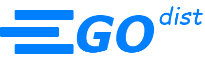

<div id="top"></div>

<div align="center">
  <a href="https://github.com/OxyProgrammer/go-dist">
    
  </a>
  <br/>
  <h1 align="center"><u>Go Dist</u></h1>

  <p align="center">
    Welcome to go-dist!
    <br/>
    <a href="https://github.com/OxyProgrammer/go-dist/issues">Report Issue</a>
    ·
    <a href="https://github.com/OxyProgrammer/go-dist/issues">Request Feature</a>
  </p>
  </div>

[](https://github.com/OxyProgrammer/go-dist/issues)
[](https://github.com/OxyProgrammer/go-dist/network)
[](https://github.com/OxyProgrammer/go-dist/stargazers)
[](https://github.com/OxyProgrammer/go-dist)

<!-- ABOUT THE PROJECT -->

## About The Project

This repository contains a microservices implementation using Google golang, rabbit mq and NextJs.

<p align="right">(<a href="#top">back to top</a>)</p>

## Tech Stack

<br/>
<p align="center">
  
</p>
<p align="right">(<a href="#top">back to top</a>)</p>


## Go Dist Demo
A quick screen recording of how to bring up Go Dist on your local machine and how to interact with the various services using the UI.
<p align="center">
  
</p>

<p align="right">(<a href="#top">back to top</a>)</p>

## What is Go Dist?

This repository contains an implementation of a distributed system using Golang and NextJs. Various messaging protocols are being used to demonstrate powerful capabilities provided by golang. The following services are part of Go Dist:

### Frontend
It is a Web UI created using Next14 and offers the interface to interact with the golang distributed system. The Frontend interacts withe the broker service alone.  

### Broker Service
The Broker Service is the entry point of the system, and the UI communicates directly with this service. While it may seem like an API gateway, it serves a different purpose. This service handles UI requests and delegates them to internal services using various protocols such as HTTP or RPC. Only the Broker Service has its ports exposed to the internet, ensuring that no other service can be accessed directly by the client.

### Auth Service
The Auth Service is responsible for authorization based on correct credentials. It operates with its dedicated PostgreSQL database. This service only accepts HTTP requests and also sends an HTTP request to the Logger Service to log successful login events.

### Logger Service
The Logger Service has a dedicated MongoDB database to store logs of various events. It accepts only HTTP requests. Additionally, the Logger Service provides RPC calls used by the Broker Service for _GettingAllLogs_ and _ClearingAllLogs_.

### Listener Service
The Listener Service does not provide any HTTP endpoints. Instead, it listens for events published in the event queue and handles them by sending HTTP requests to the appropriate service based on the event topic. For example, the _log_topic_ is monitored for events that require data logging.

### Mail Service
The Mail Service is dedicated to sending emails and offers an HTTP endpoint for this purpose. It is accessed directly by the Broker Service to send emails to MailHog. The implementation allows for replacing MailHog with any real SMTP server.

### Flow Diagram
Below is a flow diagram of the entire system. Since a picture is worth a thousand words, it provides a visual representation of everything explained above.


<p align="center">
  
</p>

<p align="right">(<a href="#top">back to top</a>)</p>


## Setup

You will need docker desktop on your machine to be able to run this repo. You will need docker-compose to run the code.

- Clone the repository to your local machine:

  ```
  git clone https://github.com/OxyProgrammer/go-dist.git
  ```
- Navigate to the project directory:

  ```
  cd go-dist
  ```

- You need to build the docker images for the various services (including the UI service.). Notice that you have the docker-compose.yaml file in the directory. In your terminal run:

  ```
  docker-compose build
  ```

- Bring the service containers up with the following command:
  ```
  docker-compose up -d
  ```

- Please note the PostgreSQL database needs to be seeded to be able to function properly. Connect to the postgresql container (
  - host: _**localhost**_ 
  - port: _**5432**_
  - username: _**postgres**_ 
  - password: _**password**_ 
  - db: _**users**_ 

  You may connect to the postresql using [PgAdmin](https://www.pgadmin.org/) or any Visual Studio Extension for Postgres. Once connected you will need to run the sql script from [here](https://github.com/OxyProgrammer/go-dist/blob/main/dbScript/users.sql). 

- If everything works well, you should be able to bring up the frontend by hitting [http://localhost:5000](http://localhost:5000).

## Contributing

Contributions are welcome! If you'd like to contribute to this project, please follow these steps:

- Fork the repository.
- Create a new branch for your feature or bug fix.
- Make your changes.
- Test your changes thoroughly.
- Commit your changes with descriptive commit messages.
- Push your changes to your fork.
- Submit a pull request to the main repository's main branch.
- **_License_**: This project is licensed under the MIT License.

<p align="right">(<a href="#top">back to top</a>)</p>

## Acknowledgements

- [Go](https://go.dev/)
- [Docker Desktop](https://www.docker.com/products/docker-desktop)
- [MailHog](https://github.com/mailhog/MailHog)

<p align="right">(<a href="#top">back to top</a>)</p>

## Contact

If you have any questions, suggestions, or issues, please feel free to contact the project maintainer:

OxyProgrammer - oxyprogrammer@gmail.com

Project Link: [https://github.com/OxyProgrammer/go-dist](https://github.com/OxyProgrammer/go-dist)

<p align="right">(<a href="#top">back to top</a>)</p>